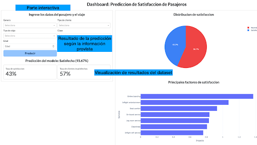
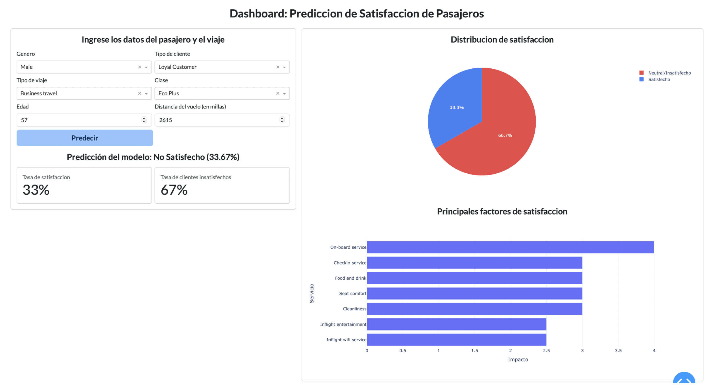

# Manual de uso del tablero

Para el entendimiento del uso del tablero, el manual se compone de tres secciones principales:

1. **Partes del tablero**
2. **Paso a paso del uso**
3. **Interpretación de resultados**

---

## 1. Partes del tablero

La parte interactiva corresponde al **predictor del modelo**, donde hay seis variables sobre las cuales se pueden seleccionar o ingresar valores:

- **Género**
- **Tipo de cliente** (leal o no a la aerolínea)
- **Tipo de viaje**
- **Clase en la que viaja**
- **Edad**
- **Distancia en millas del vuelo**

El resultado de la predicción aparece al lado del botón **“Predecir”**, e indica si el cliente estará satisfecho o no, junto con la probabilidad correspondiente.

Las demás secciones del tablero muestran los **resultados generales** según la información con la cual se construyó el modelo:  
- La **proporción** de clientes satisfechos e insatisfechos  
- Los **servicios con mayor impacto** en la predicción, como el “check-in online”, que influye fuertemente en los resultados.

---

## 2. Paso a paso de cómo usar el tablero

Una vez el tablero esté desplegado (según el Manual de instalación), se observará la interfaz inicial. Luego se debe:

1. **Diligenciar las características del cliente y del viaje**, según:
   - **Género:** Femenino o Masculino  
   - **Tipo de cliente:** Leal o Desleal  
   - **Tipo de viaje:** Laboral o Personal  
   - **Clase:** Negocios, Eco o Eco Plus  
   - **Edad:** Número entero con la edad del cliente  
   - **Distancia en millas:** Número correspondiente a la distancia del vuelo  

2. **Hundir el botón “Predecir”**.  
   Con esto se obtendrá el resultado según las características ingresadas.

Después de esto, la predicción se actualizará.

---

## 3. Interpretación de resultados

Debajo del botón **“Predecir”**, se muestra la predicción realizada.  
Allí se indica:

- Si el cliente **estará satisfecho o no**
- El **porcentaje de probabilidad** de que esté satisfecho

Ejemplo: *“No satisfecho” con un 33.67% de probabilidad de que sí esté satisfecho.*

Además, se actualizan los elementos gráficos del tablero, donde se visualiza:

- La **distribución de satisfacción**
- Los **principales factores** que influyeron en la predicción realizada

---
